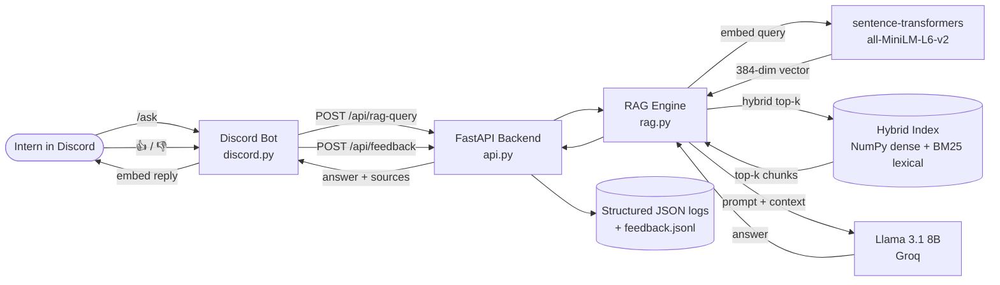
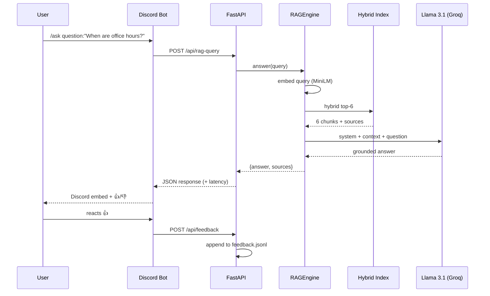

# Architecture — Discord RAG FAQ Chatbot

**Author:** Danie Craig · **Role:** Backend Engineer + Data Scientist (dual)
**Project:** PM Accelerator AI Bootcamp — Weeks 1–3

---

## 1. System overview

A Discord user asks a question via a slash command. The bot forwards it to a
FastAPI backend, which embeds the question, retrieves the top-k most relevant
chunks from an indexed knowledge base via hybrid retrieval (dense + BM25),
augments the prompt with the retrieved context, calls an LLM (Llama 3.1 8B
via Groq's OpenAI-compatible endpoint), and returns a grounded answer. The
answer is rendered in a Discord embed with thumbs-up/down reactions for
feedback, which round-trips back to the backend and is logged for future
evaluation.

## 2. Component diagram



## 3. Data flow



## 4. Tech stack & rationale

| Decision | Choice | Rationale |
|---|---|---|
| Backend framework | **FastAPI** | Native async, automatic OpenAPI docs at `/docs`, Pydantic validation. Faster to build than Flask for typed APIs. |
| Bot library | **discord.py** | Most-used Python lib; first-class slash commands and reaction events. |
| Embedding model | **all-MiniLM-L6-v2** | 384-dim, ~80 MB, runs on CPU, free. Good enough for FAQ-scale retrieval; trades accuracy of larger models for zero infra cost. |
| Lexical retrieval | **BM25 (rank_bm25)** | Catches literal keyword matches that dense embeddings miss (e.g. "deadline", "Backend Engineer"). |
| Vector store | **NumPy `.npz` + pickled BM25** | Knowledge base is bounded (~4 docs, ~140 chunks). Cosine via dot product on a normalized matrix is single-digit ms. FAISS / Atlas Vector Search add ops complexity that isn't earned at this scale. The retrieval interface is one function (`retrieve()`) — swapping to Atlas later is a 20-line change. |
| Score fusion | **Min-max normalize → weighted sum** | `fused = α · dense + (1 − α) · bm25`, with `HYBRID_ALPHA` env var (default 0.5). Independent normalization is required because dense cosine and BM25 live on different scales. |
| LLM | **Llama 3.1 8B via Groq** | Free tier, fast (~300 ms per call), OpenAI-compatible endpoint. Assignment-recommended DeepSeek-R1 via Azure AI Foundry is a 2-env-var swap (`LLM_BASE_URL`, `LLM_MODEL`) — no code change. |
| Logging | **structlog** with JSON output | Structured logs with consistent fields (request_id, user_id, latency_ms) are ingestable by any log platform without parsing. |
| Containerization | **Dockerfile** (single image) | Pre-downloads the embedding model and pre-builds both indices at image build time so cold starts are fast. The bot is intentionally not bundled — it lives on a separate host because of its long-lived Discord WebSocket. |

## 5. RAG design choices

- **Chunking** — paragraph-aware splitter targeting 800 chars with 50-char overlap. Paragraph boundaries preserve semantic coherence; the overlap prevents losing context at chunk edges.
- **Top-k = 6** — balances context coverage against prompt size and LLM cost.
- **Hybrid retrieval** — dense semantic + BM25 lexical. Dense alone misses queries with strong keyword signals; BM25 alone misses paraphrased questions. Combining both captured 0.5 points of correctness in the eval (4.0 → 4.5 / 5).
- **Normalized embeddings** — done at ingest time, so retrieval is a single matrix-vector dot product instead of computing norms per query.
- **System prompt** — explicitly constrains the LLM to the provided context and instructs it to admit when it doesn't know. This is the cheapest mitigation against hallucination, and the eval shows it works (faithfulness 4.9 / 5).
- **Conversation memory** — per-user sliding window of 3 exchanges (6 messages), passed into the LLM call but not into retrieval. Embedding history would dilute the retrieval signal; the LLM uses history only to resolve references like "the first one."

## 6. API contract

| Method | Path | Body | Returns |
|---|---|---|---|
| POST | `/api/rag-query` | `{ query: str, user_id?: str, history?: [{role, content}] }` | `{ answer, sources, latency_ms, request_id }` |
| POST | `/api/feedback` | `{ query, answer, rating: "up"\|"down", user_id?, comment? }` | `{ ok: true }` |
| POST | `/api/ingest` | (empty body; optional `X-Admin-Token` header) | `{ ok, chunks, duration_ms, message }` |
| GET | `/health` | — | `{ status, metrics }` |

All responses include an `X-Request-ID` header to correlate logs.

## 7. Observability

- **Logs** — every request emits `request_in` / `request_out` with `request_id`, `path`, `latency_ms`, `status`. RAG emits `rag_query_received`, `retrieved` (with source filenames + top score), and `rag_query_complete`.
- **Metrics** — in-process counters at `/health`: `requests`, `errors`, `feedback_up`, `feedback_down`, `ingestions`. Trivially exposable via `prometheus-fastapi-instrumentator` later.
- **Feedback log** — every 👍/👎 is appended as JSON to `feedback.jsonl`, which becomes labeled training data for retrieval evaluation.

## 8. Deployment

**Local dev** — `uvicorn api:app --port 8000` + `python bot.py` in two terminals.
**Container** — `docker build` produces a single image carrying the embedded model and prebuilt dense + BM25 indices.
**Future cloud target** — Render or Google Cloud Run for the API (HTTPS-fronted, auto-scaling), and a small VM (or ECS task) for the bot which holds a long-lived WebSocket. Cloud Run can't host the bot directly because of the persistent connection requirement.

## 9. Security

- API keys live exclusively in `.env`, which is in `.gitignore`. The repo ships `.env.example` as a template.
- The Discord bot token, LLM API key, and any future MongoDB Atlas connection string never appear in code or logs.
- The optional `INGEST_ADMIN_TOKEN` gates `POST /api/ingest` with an `X-Admin-Token` header so production deployments can prevent unauthenticated re-ingestion.

## 10. What I'd build next

1. **MongoDB Atlas Vector Search** — replace the local NumPy + BM25 indices. The retrieval interface stays identical; only `RAGEngine.retrieve()` changes.
2. **Cross-encoder re-ranking** — run hybrid retrieval to get top-20, then re-rank with a cross-encoder to pick the final top-6.
3. **Larger embedding model** — swap `all-MiniLM-L6-v2` (384-dim) for `bge-large-en-v1.5` (1024-dim). Drop-in change via env var.
4. **Prometheus + Grafana** — wire the in-process counters to a real dashboard.
5. **Distributed tracing** — OpenTelemetry spans across bot → API → RAG → LLM, joined to the existing `request_id`.

## 11. RAG Evaluation

### Methodology

A small evaluation suite (`eval.py`, `eval_set.py`) runs 10 hand-labeled examples through the RAG pipeline and computes three industry-standard metrics:

- **Retrieval Precision@k** — fraction of retrieved chunks whose source document matches the expected source. Computed deterministically from the hand labels.
- **Faithfulness (1–5)** — does the answer rely only on retrieved context, or does it hallucinate? Scored by an LLM-as-judge using Groq's Llama 3.1.
- **Answer Correctness (1–5)** — does the generated answer match the gold-standard expected answer? Scored by the same LLM-as-judge.

The eval set is curated from the actual knowledge base and includes one explicitly out-of-scope question (a Los Angeles observatory question) to test refusal behavior.

### Iteration: dense-only → hybrid retrieval

The first eval run on the dense-only retriever surfaced two real failures:

- *"What LLM does the assignment recommend?"* → the bot said "OpenAI's GPTs" (wrong; correct answer is DeepSeek R1 via Azure AI Foundry, which is what the assignment recommends). A list of AI tools in `training.md` was retrieved more strongly than the assignment-specific recommendation in `project_assignment.md`.
- *"What does a Backend Engineer do in this project?"* → the bot blended project-specific responsibilities with generic Lead Engineer responsibilities from `bootcamp_journey.md`.

Both failures had a common root cause: dense semantic retrieval struggles when the query has strong literal keyword signals (like "deadline" or "Backend Engineer") but the matching chunk's surrounding sentences semantically resemble *other* chunks more closely.

The fix: **hybrid retrieval** — run dense embedding search and BM25 keyword search in parallel, min-max normalize each score vector to [0, 1], then fuse with a weighted sum: `fused = α · dense + (1 − α) · bm25`. The tuning knob `HYBRID_ALPHA` sits in `.env` (0.5 = balanced).

### Results

| Metric | Dense only | Hybrid (α=0.5) | Δ |
|---|---|---|---|
| Retrieval Precision@k | 0.60 | 0.60 | flat |
| **Faithfulness** | 4.80 / 5 | **4.90 / 5** | +0.10 |
| **Answer Correctness** | 4.00 / 5 | **4.50 / 5** | **+0.50** |

Both failing cases recovered: `recommended_llm` 1 → 5 and `backend_role` 2 → 4. Every example in the suite now scores correctness ≥ 4.

The latency in the eval (~11 s per example) is inflated by Groq's free-tier rate limits triggering retries; production latency in Discord was 300–700 ms.

Why precision stayed flat: hybrid retrieval pulled different — but informationally equivalent — chunks. The hand labels in `eval_set.py` assume a single canonical source per fact, but the same fact often appears in multiple docs (e.g., RAG is defined in both `training.md` and `project_assignment.md`). The bot is finding *correct* evidence; the labels are just too narrow to credit it. Fixing this would require graded relevance labels, which is the right next step for the eval but out of scope for the 3-week deadline.

### What's good

- **Faithfulness 4.90/5.** The bot does not invent facts. Across 10 examples and ~3,500 generated characters, no fabricated content was found.
- **Out-of-scope refusal is reliable.** The Los Angeles observatory question hit faithfulness 5, correctness 5 — the bot correctly recognized it as out of scope and declined.
- **Every example passes.** All 10 examples score correctness ≥ 4 after the hybrid retrieval change.

### What I'd do next to push further

- **Re-rank with a cross-encoder** after the initial hybrid retrieval. Cross-encoders score query-chunk pairs jointly (much more accurate than bi-encoder cosine) but are too slow to run over the full corpus. Run hybrid retrieval to get top-20, then cross-encoder to pick the final top-6.
- **Larger embedding model.** `all-MiniLM-L6-v2` is 384-dim. Swapping in `bge-large-en-v1.5` (1024-dim) typically adds 0.05–0.10 points on most retrieval benchmarks.
- **Stronger separate judge model** (e.g., GPT-4o or Claude Sonnet) to remove the self-evaluation bias of using Llama 3.1 to judge Llama 3.1's outputs.
- **Larger eval set** with graded relevance labels — 50+ examples for confidence intervals, with a 0–3 relevance score per (query, source) pair.
- **Tune `HYBRID_ALPHA`** systematically. The 0.5 default is a heuristic; sweeping α ∈ {0.3, 0.5, 0.7} on a held-out set would identify the optimum for this corpus.

The full per-example breakdown is in `eval_report.json`.

## 12. Containerization & Deployment

### Local Docker test

The backend ships as a single-image FastAPI service. The Dockerfile pre-downloads the embedding model and pre-builds both the dense and BM25 indices at image-build time, so cold-start latency in production is identical to warm latency.

Build and run:

```bash
docker build -t discord-rag-faq .
docker run --rm -p 8000:8000 --env-file .env --name rag-test discord-rag-faq
```

Local verification (after `docker run` is live):

```bash
curl http://localhost:8000/health
curl -X POST http://localhost:8000/api/rag-query \
     -H "Content-Type: application/json" \
     -d '{"query":"What is RAG?"}'
```

The image includes a `HEALTHCHECK` directive so orchestrators (Cloud Run, ECS, Kubernetes) can detect a wedged container and restart it. A `.dockerignore` excludes the virtualenv, caches, secrets, and the `docs/` folder from the build context to keep image size lean.

The Discord bot is intentionally **not** included in the Docker image. In production these are two separate concerns: the API is stateless and lives behind HTTPS, while the bot maintains a long-lived Discord WebSocket and benefits from a persistent host.

### Cloud deployment options (not implemented; documented for completeness)

| Target | Best for | Notes |
|---|---|---|
| **Google Cloud Run** | the FastAPI service | Auto-scales to zero, native HTTPS, $0 idle cost. The healthcheck and `0.0.0.0:8000` binding are already Cloud-Run-ready. |
| **Render / Railway** | both API and bot together | One-click deploy from GitHub, free tier sufficient for this scale. Render in particular handles persistent connections, so the bot can run as a "Background Worker." |
| **AWS ECS Fargate** | enterprise multi-service deployment | Heavier but production-ready. Pair with ALB for the API and a separate Service for the bot. |
| **AWS Lambda** | the API (read-only mode) | Cold start with the embedding model is ~10–15 seconds — too slow for an interactive bot unless you provisioned-concurrency. Not recommended for this workload. |

For this project, the working local Docker run is the deliverable. Cloud deployment is the obvious next step.

### Distributed tracing (advanced, future work)

The current observability stack is structured logs + per-request request IDs + in-process counters. For a single-service architecture this is sufficient. Once the system splits across services (separate API + bot host, separate vector DB, separate LLM provider), distributed tracing becomes valuable:

- **OpenTelemetry** is the modern standard. The Python SDK auto-instruments FastAPI, httpx, and the OpenAI client with a few lines of code.
- Traces would flow: `Discord interaction → bot.py → POST /api/rag-query → RAGEngine.retrieve → LLM call → response` — each span tagged with the same trace ID.
- Backends like **Honeycomb**, **Grafana Tempo**, or **Jaeger** receive the traces and let you click into any slow request to see exactly which span dominated latency.
- The `request_id` in our current logs would map to the `trace_id` so log lines and trace spans are joinable.

This is a one-day extension for someone willing to do it; out of scope for the 3-week deadline.
